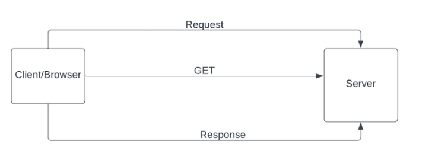

# How The Web Works - Fundamentals

## The Client-Server Architecture

### Understanding the Request-Response Cycle

The entire web is built on a simple but powerful concept: the request-response cycle between clients and servers. A client is any device or application that requests resources or services—your web browser, a mobile app, or even another server making API calls. A server is a computer that waits for requests and responds with the requested data or services. This relationship is fundamental to everything that happens on the internet. When you type a URL into your browser and press enter, you're initiating a request. The server receives that request, processes it, and sends back a response. This back-and-forth communication is the heartbeat of the web.

Think of this like ordering food at a restaurant. You (the client) make a request by ordering a meal. The kitchen (the server) receives your order, prepares the food, and sends it back to you. The waiter serves as the communication channel. You don't need to know how the kitchen operates internally—you just need to know how to order and what to expect in return. Similarly, your browser doesn't need to know how a web server is implemented; it just needs to follow the protocol for making requests and handling responses.

What makes this architecture powerful is its simplicity and scalability. One server can handle thousands or even millions of clients simultaneously. Each request is independent—the server doesn't need to remember previous interactions unless explicitly designed to do so (like with sessions or cookies). This stateless nature means servers can be replicated, load-balanced, and distributed across the globe. When you visit a website, you might be talking to a server in a different continent, but the request-response cycle works exactly the same way whether the server is next door or across the ocean.

### The Three-Tier Architecture: Client, Server, and Database

Most modern web applications follow a three-tier architecture that separates concerns and responsibilities. The client tier is what users interact with—web browsers, mobile apps, or desktop applications. This tier handles presentation and user interaction, displaying information and capturing user input. The client is relatively "dumb" in the sense that it doesn't store or process significant amounts of data; it just renders what the server sends and forwards user actions back to the server.

The server tier sits in the middle and contains the application logic—the business rules, data processing, authentication, and authorization. When a client requests data, the server determines what data to retrieve, how to process it, and what to send back. The server doesn't just blindly forward database queries; it validates requests, enforces security policies, applies business logic, and formats responses. This middle layer is where Node.js typically operates. Your Express applications, API servers, and web services all live in this tier, receiving requests from clients and orchestrating responses.

The database tier is where persistent data lives. Databases store user information, product catalogs, transaction records, and any other data the application needs to remember between requests. The server communicates with the database using specialized protocols and query languages (like SQL for relational databases or MongoDB's query language for document databases). The database is isolated from clients—they can't talk to it directly. This separation provides security (clients can't execute arbitrary queries) and flexibility (you can change database technologies without affecting clients). The server acts as a controlled gateway, translating client requests into appropriate database operations and translating database results into client-friendly responses.

### IP Addresses: The Internet's Street Addresses

Every device connected to the internet has an IP address—a unique identifier that allows other devices to find and communicate with it. Think of IP addresses as street addresses for computers. When you want to send someone a letter, you need their street address. When your computer wants to communicate with a server, it needs that server's IP address. There are two versions of IP addresses in use today: IPv4 addresses look like `192.168.1.1` (four numbers separated by dots, each ranging from 0 to 255), and IPv6 addresses look like `2001:0db8:85a3:0000:0000:8a2e:0370:7334` (eight groups of hexadecimal numbers, created because we're running out of IPv4 addresses).

Your device has a client IP address assigned by your internet service provider or local network. When you make a request to a website, your IP address is included in that request so the server knows where to send the response. This is like writing a return address on an envelope—the post office needs to know where to deliver the reply. Server IP addresses are typically static (they don't change) because they need to be consistently reachable. Domain names like `google.com` are human-friendly aliases for IP addresses. When you type `google.com` into your browser, a DNS (Domain Name System) server translates that name into an IP address like `172.217.14.206`, which is what your computer actually uses to connect to Google's servers.

The relationship between client IPs and server IPs is crucial for web communication. Every request your browser makes includes your IP address in the packet headers. The server uses this address to route its response back to you. In between your client and the server, the request might pass through dozens of routers and intermediate devices, each using the IP addresses to determine where to forward the packet next. This routing happens transparently—you just experience it as typing a URL and getting a web page back, but underneath, your request is hopping across the internet infrastructure, guided by IP addresses at each step.

---

## How Data Travels: Sockets and TCP

### Understanding Sockets

A socket is an endpoint for sending and receiving data across a network. Think of a socket as a telephone handset—it's the interface through which communication happens. When your browser wants to connect to a web server, it creates a socket on your computer and connects it to a socket on the server. Once this connection is established, data can flow in both directions. The socket abstraction hides the complexity of network communication, providing a simple interface: open a connection, send data, receive data, close the connection.

Sockets are identified by a combination of an IP address and a port number. The IP address tells you which computer to connect to, and the port number tells you which specific service or application on that computer you want to talk to. It's like an apartment building analogy—the IP address is the building's street address, and the port number is the apartment number. One server (one IP address) can run multiple services (web server, email server, file server) on different ports, and sockets allow clients to connect to the specific service they need.

When you establish a socket connection, the operating system handles most of the complexity—managing the actual network interface, breaking data into packets, handling transmission errors, and reassembling packets at the other end. Your application code just reads from and writes to the socket as if it were a file or stream. This simplification is powerful because it means Node.js developers can build networked applications without understanding the intricate details of network protocols. You work with sockets at a high level, and the underlying system handles the low-level networking.

### TCP: Reliable Data Transmission

TCP (Transmission Control Protocol) is the foundation of reliable internet communication. When you send data over TCP, the protocol guarantees that the data arrives at the destination in the correct order, without errors, and without missing pieces. This reliability is crucial for web applications—imagine loading a web page where paragraphs arrive out of order or images are missing random chunks. TCP prevents this by implementing sophisticated mechanisms for error detection, retransmission, and flow control.

Here's how TCP works at a conceptual level: when you send data (like an HTTP request), TCP breaks it into smaller chunks called packets or segments. Each packet gets a sequence number so the receiver knows what order to reassemble them in. The packets travel independently across the internet—they might take different routes and arrive out of order. When packets arrive at the destination, TCP uses the sequence numbers to reassemble them into the original data stream. If a packet gets lost or corrupted during transmission, TCP detects this (using checksums) and requests retransmission. The sender keeps copies of packets until it receives acknowledgment that they arrived successfully.

TCP also implements flow control, which prevents fast senders from overwhelming slow receivers. Imagine a server that can send data much faster than a client's slow internet connection can receive it. Without flow control, the network would become congested, packets would be dropped, and performance would suffer. TCP solves this by having receivers tell senders how much data they can handle, allowing the sender to adjust its transmission rate accordingly. This adaptive behavior is why file downloads can start slowly and then speed up—TCP is figuring out the optimal transmission rate for your connection.

The tradeoff with TCP is overhead. All this reliability—sequence numbers, acknowledgments, retransmissions, flow control—adds complexity and latency. That's why some applications use UDP (User Datagram Protocol) instead, which is faster but unreliable. Video streaming, online gaming, and voice calls often use UDP because they prioritize low latency over perfect reliability—a few dropped packets in a video stream are less noticeable than the delay from retransmitting them. But for web traffic, where correctness is paramount, TCP is the standard choice.

---

## Server Types and Protocols

### HTTP: The Protocol of the Web

HTTP (Hypertext Transfer Protocol) is the application-layer protocol that powers the web. When your browser requests a web page, it sends an HTTP request to the server. When the server responds with HTML, CSS, JavaScript, and images, it uses HTTP to format and deliver that response. HTTP sits on top of TCP—TCP handles reliable packet delivery, and HTTP defines how web clients and servers structure their communication.

An HTTP request consists of several parts: a method (GET, POST, PUT, DELETE, etc.) that indicates what action you want to perform, a URL that specifies what resource you're requesting, headers that provide metadata (like what types of content the client accepts), and optionally a body containing data being sent to the server (like form submissions). The server processes this request and sends back an HTTP response consisting of a status code (200 for success, 404 for not found, 500 for server error, etc.), response headers (metadata about the response), and a response body (the actual content—HTML, JSON, images, etc.).

HTTP is stateless, meaning each request is independent—the server doesn't remember previous requests from the same client unless you explicitly implement state management through cookies, sessions, or authentication tokens. This statelessness simplifies server design because servers don't need to maintain memory of every client interaction, but it requires additional mechanisms when you need to maintain state (like keeping a user logged in across multiple requests). Modern web applications typically use cookies or JWT tokens to maintain session state across the stateless HTTP protocol.

HTTPS is the secure version of HTTP, where all communication is encrypted using TLS (Transport Layer Security). When you see a padlock icon in your browser, you're using HTTPS. This encryption prevents attackers from eavesdropping on your communication or tampering with data in transit. HTTPS is now the standard for all web traffic—browsers actively warn users when visiting non-HTTPS sites, and search engines penalize sites that don't use encryption. For Node.js developers, supporting HTTPS is as simple as using an HTTPS module instead of HTTP and providing SSL certificates.

### FTP: File Transfer Protocol

FTP (File Transfer Protocol) is designed specifically for transferring files between computers. Unlike HTTP, which is primarily request-response based and stateless, FTP maintains a persistent connection and is optimized for uploading and downloading large files. FTP uses two separate connections: a control connection for sending commands (like "list files in this directory" or "delete this file") and a data connection for actually transferring file contents. This separation allows for efficient bulk file transfers while maintaining responsive command interaction.

FTP operates on well-defined ports—typically port 21 for the control connection. When you connect to an FTP server using an FTP client, you authenticate with a username and password, then you can navigate directories, upload files, download files, and manage the file system on the server. Many web hosting services provide FTP access so developers can upload website files to the server. However, FTP has fallen out of favor for several reasons: it transmits passwords in plain text (insecure), it's complicated to use through firewalls and NAT (Network Address Translation), and it lacks modern features like resuming interrupted transfers.

Modern alternatives have largely replaced FTP. SFTP (SSH File Transfer Protocol) provides secure file transfer by running over SSH (Secure Shell), encrypting all communication including passwords. SCP (Secure Copy Protocol) is even simpler, using SSH for authenticated, encrypted file copying. For web applications, direct file uploads via HTTP/HTTPS have largely replaced FTP because they're easier to implement, work through firewalls without issues, and integrate naturally with web applications. In Node.js, you're more likely to implement file uploads through HTTP multipart requests than to run an FTP server, though libraries exist for FTP if you need that functionality.

### SMTP: Simple Mail Transfer Protocol

SMTP (Simple Mail Transfer Protocol) is the standard protocol for sending email across the internet. When you click "send" in an email client, SMTP is what actually delivers that email from your device to the recipient's mail server. SMTP operates on port 25 (or 587 for secure submission) and uses a text-based command protocol where the sender issues commands like "MAIL FROM", "RCPT TO", and "DATA" followed by the email content.

The journey of an email involves multiple SMTP servers. Your email client connects to your outgoing mail server (SMTP server) using SMTP. That server then contacts the recipient's mail server (also using SMTP) to deliver the message. If the recipient's server is unavailable, your server will retry periodically. Finally, when the recipient checks their email, they use a different protocol (POP3 or IMAP) to retrieve messages from their mail server—SMTP is only for sending, not receiving.

In Node.js applications, you rarely implement SMTP servers yourself. Instead, you use SMTP clients to send emails through existing mail services. Popular Node.js libraries like Nodemailer let you connect to SMTP servers (Gmail, SendGrid, Amazon SES) and send emails from your application. This is common for features like password reset emails, notification emails, and confirmation emails. You provide the SMTP credentials for a mail service, compose your email (recipient, subject, body, attachments), and the library handles the SMTP protocol communication to deliver the message.

---

## Ports: Organizing Services on a Server

### What Are Ports?

A port is a numerical identifier (from 0 to 65535) that specifies which application or service on a computer should receive incoming network traffic. One server can run many different services simultaneously—a web server, a database, an FTP server, an email server—and ports are how the operating system knows which service each incoming connection is meant for. When a packet arrives at a server, it includes both an IP address (which server?) and a port number (which service on that server?). The operating system uses the port number to route the packet to the correct application.

Ports are divided into three ranges with different purposes. Well-known ports (0-1023) are reserved for standard services by convention—HTTP uses port 80, HTTPS uses port 443, FTP uses port 21, SMTP uses port 25, and so on. These assignments are standardized so clients know where to find services. Registered ports (1024-49151) can be registered for specific services but aren't as rigidly standardized. Dynamic or private ports (49152-65535) are typically used for temporary connections and client-side communication.

When you build a Node.js web server and tell it to `listen(3000)`, you're telling it to listen for incoming connections on port 3000. Any client that wants to connect to your server must specify port 3000 in their connection request. On your local machine, you might run multiple Node.js applications on different ports (3000, 3001, 3002) to avoid conflicts. In production, web servers typically run on port 80 (HTTP) or port 443 (HTTPS) because browsers automatically connect to these ports when you don't specify one—typing `example.com` in your browser is equivalent to `example.com:80`.

### Common Port Numbers in Web Development

Understanding common port assignments helps you troubleshoot connectivity issues and configure servers correctly. Here are the ports you'll encounter most frequently in web development:

**Port 80 (HTTP)**: The default port for unencrypted web traffic. When you visit `http://example.com`, your browser connects to port 80. In development, you typically use other ports (like 3000) because port 80 requires administrator privileges on most systems, but in production, web servers should listen on port 80 for HTTP traffic.

**Port 443 (HTTPS)**: The default port for encrypted web traffic. When you visit `https://example.com`, your browser connects to port 443. All production web applications should support HTTPS on port 443. Like port 80, this requires admin privileges, so development often uses alternative ports.

**Port 3000**: Conventionally used for development web servers. Many Node.js tutorials and tools default to port 3000. Express applications, React development servers, and many other tools use this port. It's not standardized—just a convention that emerged in the Node.js ecosystem.

**Port 27017**: MongoDB's default port. If you're running MongoDB locally or connecting to a MongoDB server, you typically connect to this port.

**Port 5432**: PostgreSQL's default port. Database clients connect to this port to communicate with PostgreSQL servers.

**Port 3306**: MySQL's default port. Similar to PostgreSQL, clients use this port for MySQL database connections.

When deploying applications, you need to ensure the necessary ports are open in your firewall and that no port conflicts exist (two services trying to use the same port). Cloud platforms like AWS, Azure, and Google Cloud have security group settings where you explicitly allow traffic on specific ports. Understanding ports is essential for configuring these security rules correctly.

---

## Putting It All Together: A Web Request Journey

### The Complete Request Flow

Let's trace exactly what happens when you type `https://example.com/products` into your browser and press enter. This journey spans multiple protocols, servers, and network layers, each playing a specific role in delivering the web page to your screen.

**Step 1: DNS Resolution** - Your browser doesn't know what `example.com` means—it needs an IP address. It sends a DNS query to a DNS server (typically provided by your ISP), asking "what's the IP address for example.com?" The DNS server responds with something like `93.184.216.34`. This translation happens in milliseconds and is cached to avoid repeating it for subsequent requests to the same domain.

**Step 2: TCP Connection** - Now that your browser has the IP address and knows you want HTTPS (port 443), it establishes a TCP connection. Your browser's operating system creates a socket, sends a SYN packet to `93.184.216.34:443`, receives a SYN-ACK response, sends an ACK confirmation, and the TCP connection is established. This three-way handshake ensures both sides are ready to communicate.

**Step 3: TLS Handshake** - Since you're using HTTPS, a TLS handshake occurs next. Your browser and the server negotiate encryption algorithms, exchange certificates to verify the server's identity, and establish encryption keys. This ensures all subsequent communication is encrypted and can't be intercepted. This handshake adds latency but provides security.

**Step 4: HTTP Request** - With the encrypted connection established, your browser sends an HTTP GET request for `/products`. This request includes headers like `User-Agent` (identifying your browser), `Accept` (what content types you can handle), and `Cookie` (any session data). The request is encrypted by TLS, broken into TCP packets, and transmitted across the internet.

**Step 5: Server Processing** - The packets arrive at the server's IP address on port 443. The server's operating system routes them to the web server process (maybe an Express/Node.js application). The application receives the decrypted HTTP request, parses the URL, runs the appropriate route handler, possibly queries a database for product data, and generates an HTTP response containing HTML, headers, and a status code.

**Step 6: Response Transmission** - The server sends the HTTP response back through the encrypted TLS connection. The response is broken into TCP packets and transmitted back to your IP address. Your browser's operating system receives these packets, TCP reassembles them in order, TLS decrypts them, and your browser receives the complete HTTP response.

**Step 7: Rendering** - Your browser parses the HTML response, discovers references to CSS files, JavaScript files, and images, and makes additional HTTP requests for each of these resources. Each request follows the same pattern (though the TCP/TLS connection might be reused for efficiency). As resources arrive, the browser renders them progressively, and eventually you see the complete web page.

This entire process—from typing the URL to seeing the rendered page—typically happens in under a second, involving dozens of network round-trips and multiple protocols working in harmony. Understanding this flow helps you debug issues (slow DNS? TCP connection timeouts? Server taking too long to respond?) and optimize performance (reducing round-trips, caching resources, using CDNs).

---

## Key Concepts Summary

**Client-Server architecture:**
- Clients request resources, servers provide them
- Three-tier structure: client (presentation), server (logic), database (storage)
- IP addresses identify devices; domain names are human-friendly aliases

**Data transmission:**
- Sockets provide endpoints for network communication (IP + port)
- TCP ensures reliable, ordered delivery by breaking data into packets
- Packets travel independently and are reassembled at the destination

**Application protocols:**
- **HTTP/HTTPS**: Web communication on ports 80/443
- **FTP**: File transfer on port 21 (largely replaced by SFTP/HTTP uploads)
- **SMTP**: Email transmission on port 25/587

**Ports organize services:**
- One server, many services, each on a different port
- Well-known ports: 0-1023 (HTTP=80, HTTPS=443)
- Development ports: 3000, 3001, etc.
- Database ports: MongoDB=27017, PostgreSQL=5432, MySQL=3306

---

## Why These Fundamentals Matter

Understanding how the web works at this fundamental level transforms you from someone who can follow tutorials to someone who can architect systems. When you know that HTTP runs over TCP, you understand why establishing many connections is expensive and why connection pooling matters. When you know that each service needs a unique port, you can troubleshoot deployment issues where services conflict. When you understand the complete request-response cycle, you can identify bottlenecks—is the delay in DNS resolution, TCP connection establishment, server processing, or data transmission?

These concepts also explain why certain design patterns exist. REST APIs use HTTP methods (GET, POST, PUT, DELETE) because HTTP is the protocol of the web. Microservices communicate over HTTP because it's universally supported. WebSockets exist because HTTP's request-response model isn't efficient for real-time bidirectional communication. Every technology decision in web development traces back to these fundamental protocols and patterns.

For Node.js developers specifically, understanding these concepts is crucial because Node.js gives you low-level access to network programming. You're not just using a framework that hides the details—you're creating HTTP servers, managing sockets, and implementing protocols. The better you understand the underlying mechanisms, the better equipped you are to build efficient, scalable applications and debug issues when they inevitably arise.